# GitIssue2Todoist

This application converts Git issues to Todoist tasks

This macOS and iOS application can read your GitHub repositories and convert your GitHub issues to Todoist tasks. See the following.

# Requirements

The application gathers the following:

* A GitHub API token using OAuth2
* Your GitHub username (optional)
* A Todoist API token 

# How to Use GitIssue2Todoist

`GitIssue2Todoist` allows developers to seamlessly mirror their GitHub issues as actionable Todoist tasks.

The preferred way to use `GitIssue2Todoist` is for a developer to group issues via GitHub milestones.   `GitIssue2Todoist` has several strategies for organizing the Todoist tasks.

# Prerequisites

`GitIssue2Todoist` assumes that you manage GitHub via the GitHub issue capability.   It may be helpful to group the GitHub issues under project milestones.  This is not required.   Additionally, `GitIssue2Todoist` assumes you have a [Todoist](https://todoist.com/) account.   The account may be one of the free ones or may be one of the subscription-based accounts.

# Task Creation Strategies

## Project by Repository and Single Todoist Project Workflow
The workflow is as follows:

1.  Select a repository
2.  Select a milestone
3.  Select the issues
4.  Clone the issues
5.  Create the Todoist Task

See the following image:
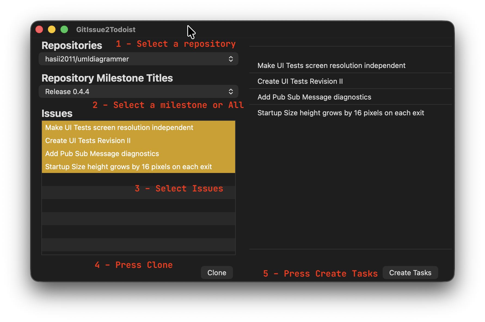

### Todoist Strategy - Project by Repository

This strategy creates projects for each GitHub repository.  This is ideal for developers who have purchased a `Todoist` license which allows unlimited projects.

`GitIssue2Todoist` initially creates a project in `Todoist` with a name that matches the repository name.  For each selected milestone that has issues, `GitIssue2Todoist` creates a `Todoist` task using the milestone name.  The issues are subtasks in the [Todoist](https://todoist.com/) milestone task.  See the following image.

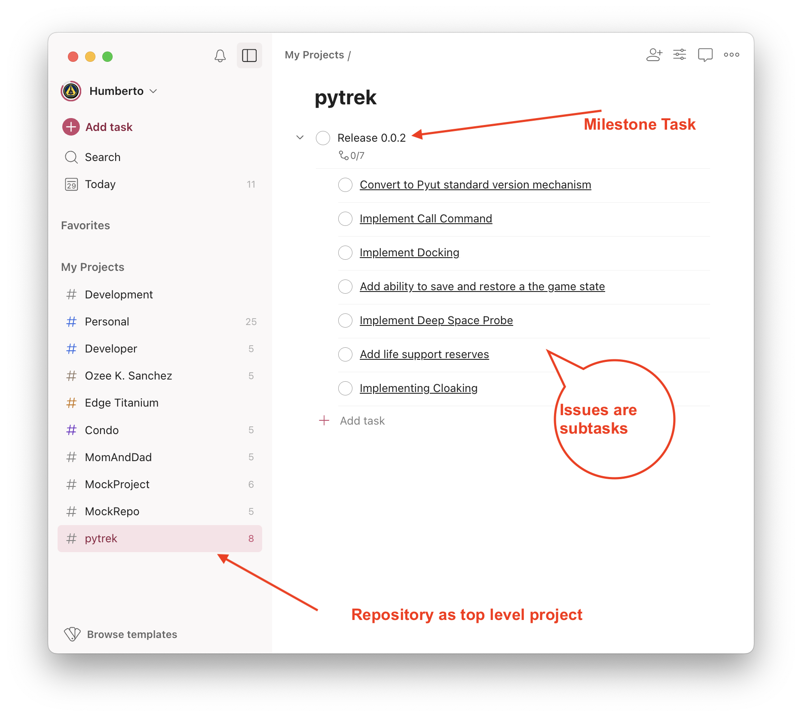

### Todoist Strategy - Single Todoist Project

This strategy creates repository tasks under a single top-level project.  This allows developers who are using the 'community' version of Todoist to create sub-tasks for all their repositories inside a single top-level project.  'Community' users are limited to five Todoist projects.

The selection mechanism is identical to the 'Project by Repository' strategy.  The following shows the location of the tasks for 2 different repositories and a single milestone each.

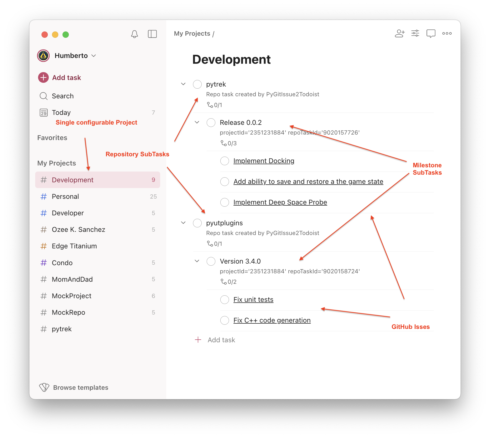

## Todoist Strategy - All Issues Assigned to User

This strategy relies on a GitHub issue selection strategy that collects issues assigned to a developer's repositories and organizations.  Once they are collected, the developer can choose to clone them all or only a selected subset.

Thus, the `GitIssue2Todoist` selection user interface is simpler as illustrated in the following image.

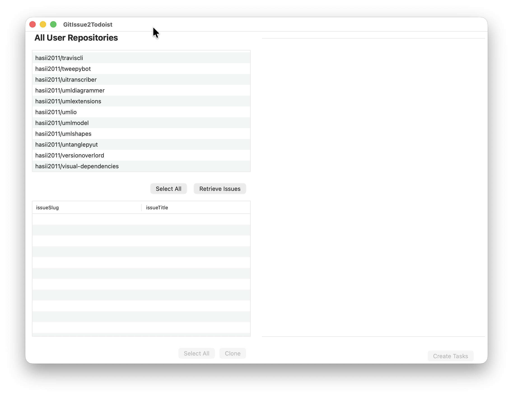

`GitIssue2Todoist` prepopulates the repository selection list during startup.  This `All Issues Assigned to User` workflow is as follows:

*   Select all the repositories or a subset.  
*   Press `Retrieve Issues`.  This can be a lengthy process.  As such, `GitIssue2Todoist` displays a progress dialog while the process completes.
*   Select the issues you wish to convert to tasks and press `Clone`.  
*   Finally, press `Create Tasks` which causes `GitIssue2Todoist` to display a task creation progress dialog as this can also be a lengthy process.

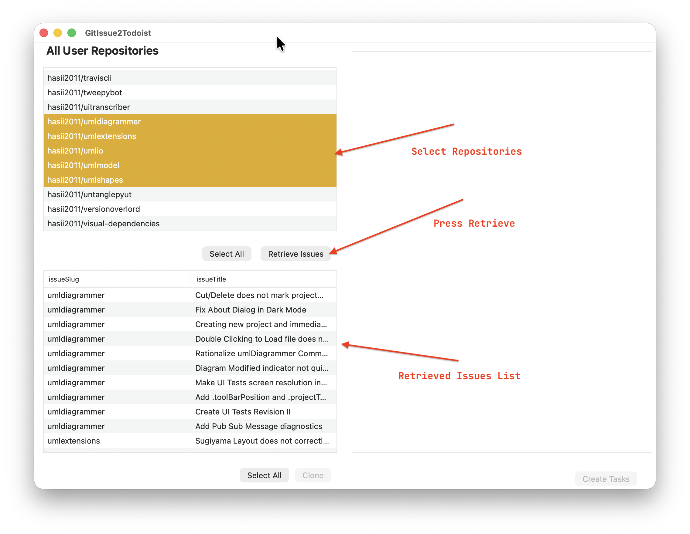

Once you press `Create Tasks` and it completes, the UI resets back to its initial state.

# Strategy Configuration

The developer picks the `Todoist` strategy via the **GitIssue2Todoist→Settings** dialog as depicted below.

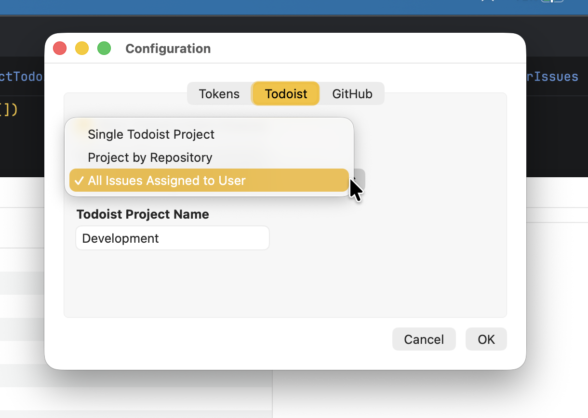

Changing strategies requires a `GitIssue2Todoist` restart.  It is not wise to mix strategies.


# How to generate the Todoist token

In a web browser, navigate to the following [URL](https://todoist.com/).  Log into your account.  In the upper right-hand corner click on your username.  See the following figure.

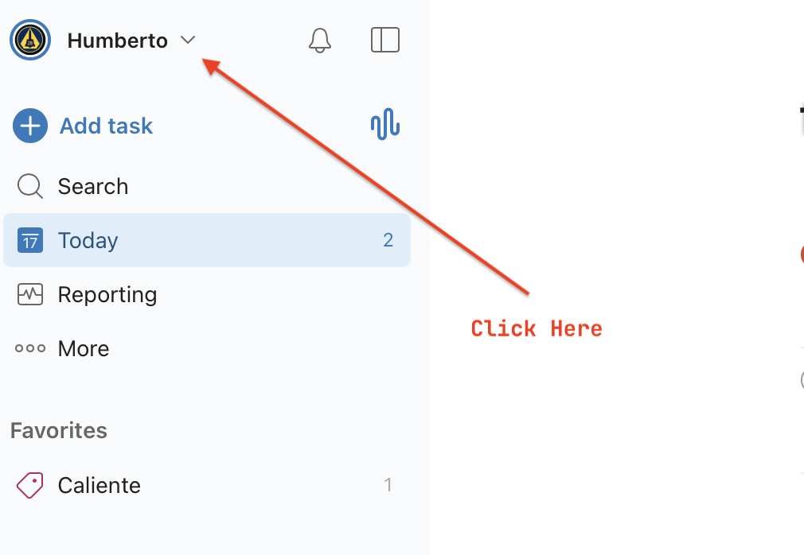


Click on Settings. See the following figure:

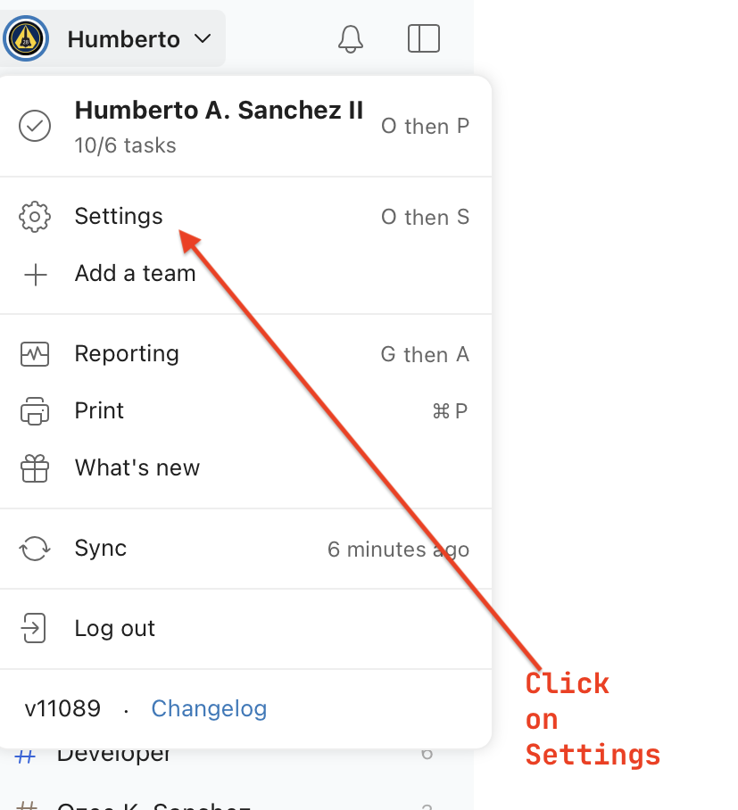


Click on Integration.  See the following figure:
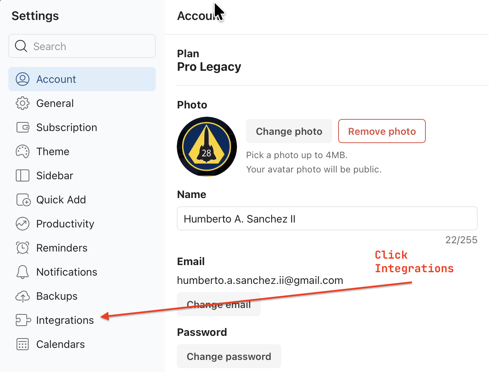


Select the Developer Tab.  See the following figure.

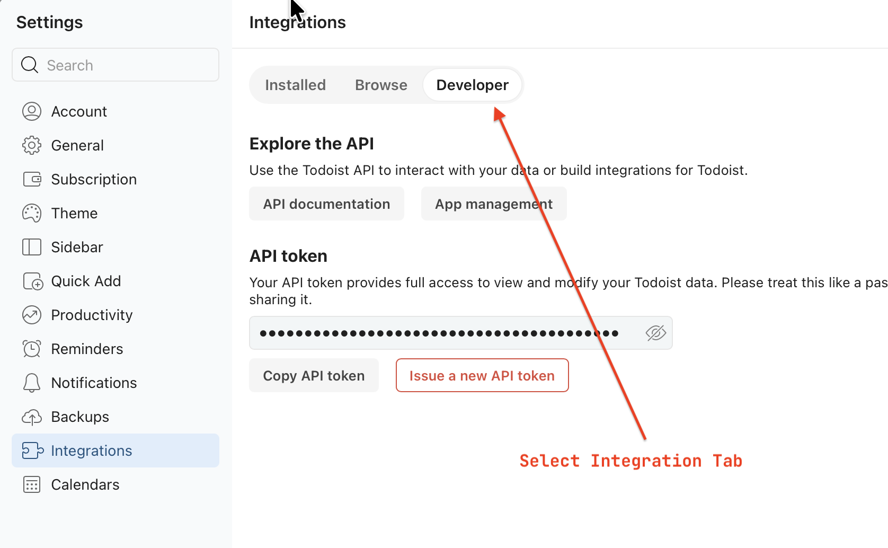

In this tab you will create a new API token.  I have already created one.  Copy the API token and use it when `GitIssue2Todoist` requests it.  See the following figure.

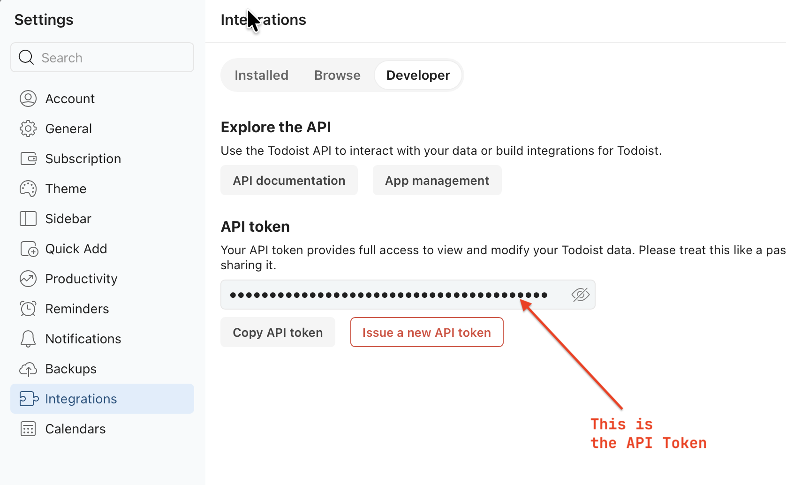

# IDE Setup

When setting up this project in an IDE (like PyCharm or VSCode), you should install the dependencies into your local virtual environment so that the IDE can correctly resolve imports (like ``toga``) and provide autocomplete.

Run the following command in your active virtual environment:

```bash

pip install -r requirements-dev.txt

```

# License

See [LICENSE](LICENSE)


I am concerned with GitHub's Copilot project

I urge you to read about the [Give up GitHub](https://GiveUpGitHub.org) campaign from [the Software Freedom Conservancy](https://sfconservancy.org).

While I do not advocate for all the issues listed there, I do not like that a company like Microsoft may profit from open source projects.

I continue to use GitHub because it offers the services I need for free.  But I continue to monitor their terms of service.

Any use of this project's code by GitHub Copilot, past or present, is done without my permission.  I do not consent to GitHub's use of this project's code in Copilot.
